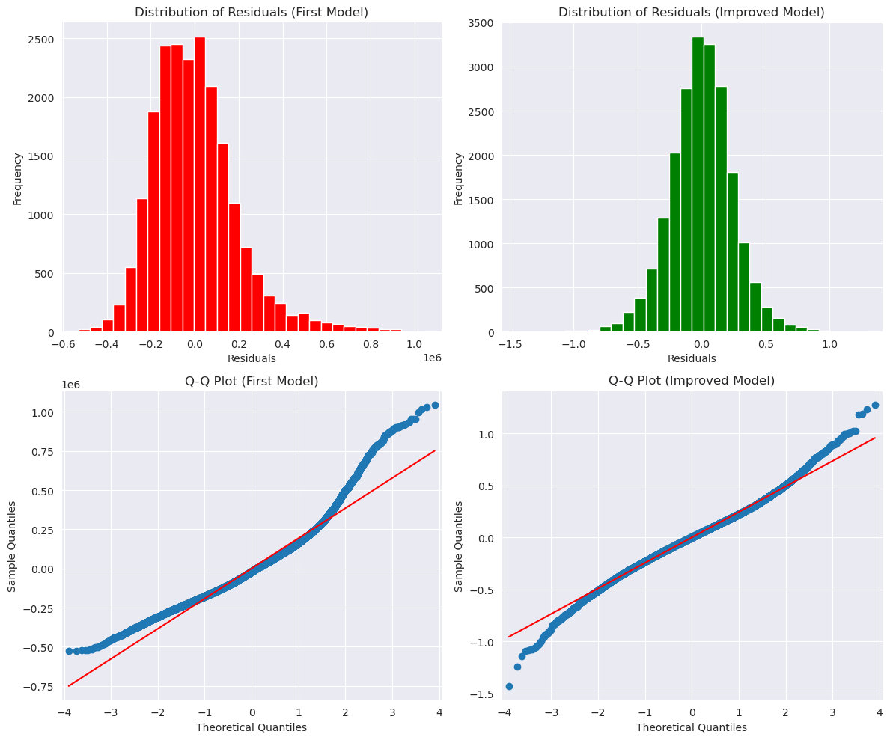
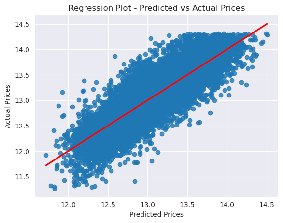
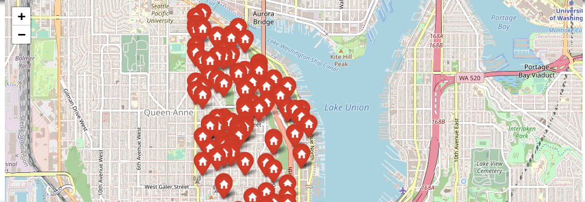
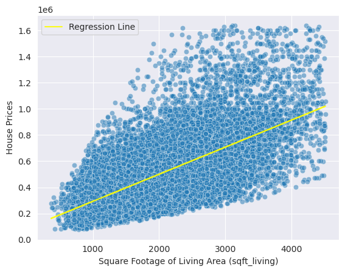
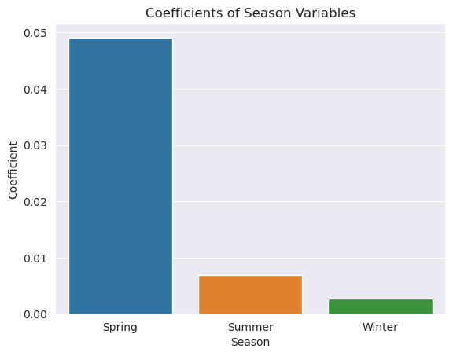

# House Renovation Using Linear Regression For SmartRenovation Realty

## Overview

Within this repository, you will find a comprehensive analysis of the King County real estate market, tailored to support SmartRenovate Realty in making well-informed investment decisions. The analysis harnesses the power of statistical modeling to uncover pivotal factors that shape property prices and return on investment. By delving into these insights, SmartRenovate Realty can strategically acquire properties, devise effective renovation plans, and optimize the timing of property resale. Through these measures, SmartRenovate Realty aims to achieve maximum profitability and thrive in the dynamic real estate landscape.

## Business Understanding

SmartRenovate Realty specializes in purchasing and renovating properties to increase their market value and profitability. The objectives of this analysis for SmartRenovate Realty are to identify high-impact renovation areas by analyzing the relationship between property features and sale prices, evaluate the cost-effectiveness of renovations to prioritize projects with the highest return on investment, and identify seasonal trends in the real estate market through analysis of historical sales data. By achieving these objectives, SmartRenovate Realty aims to make data-driven decisions on renovation projects, prioritize areas for improvement, and align their strategies with market trends and buyer preferences to enhance property values, maximize profitability, and achieve success in the real estate market.

## Data Understanding
The primary dataset used for this analysis is the King County House Sales dataset, which comprises information on real estate properties sold within King County, Washington. The dataset encompasses various attributes, including the number of bedrooms, bathrooms, square footage, condition, grade, location, and sale prices of the properties.

The King County House Sales dataset is obtained from the King County Department of Assessments and is publicly accessible for analysis.

This dataset serves as a valuable resource for gaining insights into the housing market dynamics within King County and forms the basis for the analysis conducted in this project. The dataset is thoroughly explored, undergoes data cleaning processes, and is utilized to develop a regression model that sheds light on the factors influencing property prices and returns on investment.
## Models

The analysis utilizes multiple linear regression, a statistical model, to examine the connection between different predictors and property prices. Key factors such as location, property condition, and various attributes are taken into account to identify significant drivers of property value. By analyzing these factors, the model provides valuable insights into how they influence pricing. This enables SmartRenovate Realty to make informed decisions based on data when selecting properties, devising renovation strategies, and determining the optimal timing for resale. The statistical analysis empowers SmartRenovate Realty with the knowledge needed to maximize profitability and make strategic choices throughout the real estate investment process.

## Model Comparison
First Model Compared to The last one:



## Model Validation


## Regression Results

The regression analysis yielded several significant findings:

- Property location, particularly proximity to Lake Union, has a strong positive impact on property prices.


SmartRenovate Realty can enhance property value by strategically increasing the size of houses through renovations. Additionally, investing in properties with grades presents a lucrative opportunity for increasing market value. By renovating and improving these properties, SmartRenovate Realty can maximize profitability. Success in the real estate market relies on conducting thorough market research, performing comprehensive property evaluations, and implementing strategic renovation plans to capitalize on market trends and buyer preferences.

- The model suggests that spring, with its favorable market conditions and increased buyer activity, could be a good season for purchasing properties in Lake Union but i cannot back this fact.


## Conclusion

Seasonal Considerations: The visualization reveals that the spring season has the highest prices, while winters have the lowest prices. It is recommended to take advantage of this seasonal trend by strategically timing property listings and marketing efforts to coincide with the spring season. This can potentially maximize profits by capitalizing on the higher demand and prices during this period.

Focus on Lake Union Properties: The map visualization showcases properties on Lake Union, as it was identified by the model as having a significant relationship with prices. It is recommended to prioritize acquiring properties in this area to leverage the positive influence it has on property prices. Investing in Lake Union properties can potentially yield higher returns and attract buyers who value the location and its amenities.

Size of the House: The visualization also demonstrates a positive relationship between the size of the house and its price. Smaller houses tend to have lower prices, while larger houses command higher prices. As a recommendation, the company can consider acquiring smaller-sized houses and undertaking renovation projects to increase their value. By renovating and expanding the living space, the company can potentially sell these properties at a higher price point and generate substantial profits.

Refer to the notebook for more : [student notebook](https://github.com/user-zak/Phase-2-Project/blob/main/student.ipynb)

### Presentation
Link to the Presentation :[presentation](https://github.com/user-zak/Phase-2-Project/blob/main/Presentation.pdf).
## Repository Structure
```
├── Data
│   ├── column_names.md
│   └── kc_house_data.csv
├── Images
│   ├── Image.jpeg
│   ├── map.png
│   ├── model.png
│   ├── price.png
│   ├── Seasons.png
│   └── Sqft.png
├── Presentation.pdf
├── README.md
└── student.ipynb
```
