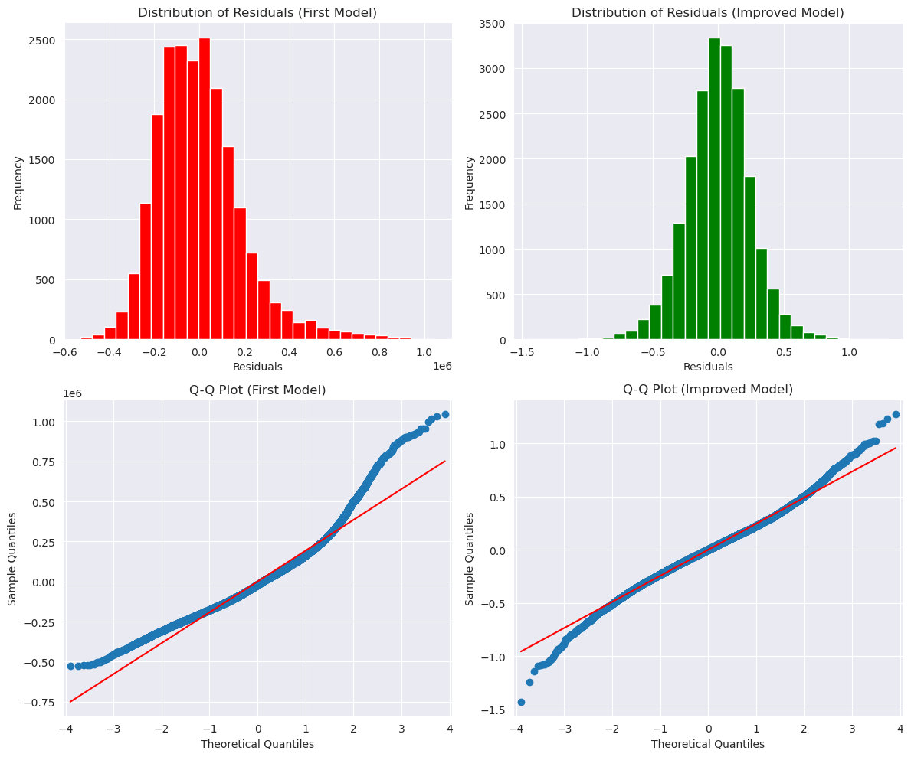
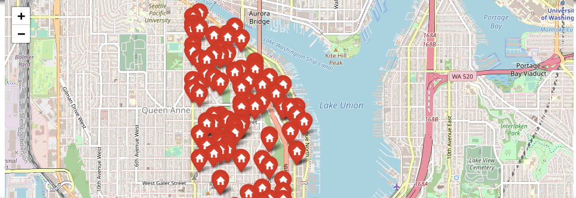
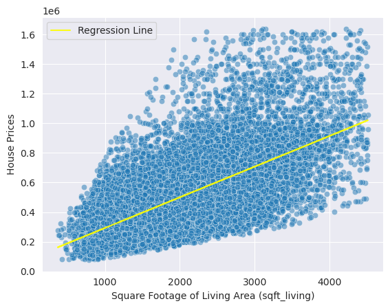
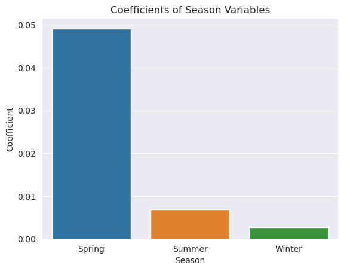

# House Renovation Using Linear Regression For SmartRenovation Realty

## Overview

Within this repository, you will find a comprehensive analysis of the King County real estate market, tailored to support SmartRenovate Realty in making well-informed investment decisions. The analysis harnesses the power of statistical modeling to uncover pivotal factors that shape property prices and return on investment. By delving into these insights, SmartRenovate Realty can strategically acquire properties, devise effective renovation plans, and optimize the timing of property resale. Through these measures, SmartRenovate Realty aims to achieve maximum profitability and thrive in the dynamic real estate landscape.

## Business and Data Understanding

SmartRenovate Realty specializes in purchasing and renovating properties to increase their market value and profitability. The objectives of this analysis for SmartRenovate Realty are to identify high-impact renovation areas by analyzing the relationship between property features and sale prices, evaluate the cost-effectiveness of renovations to prioritize projects with the highest return on investment, and identify seasonal trends in the real estate market through analysis of historical sales data. By achieving these objectives, SmartRenovate Realty aims to make data-driven decisions on renovation projects, prioritize areas for improvement, and align their strategies with market trends and buyer preferences to enhance property values, maximize profitability, and achieve success in the real estate market.

## Models

The analysis utilizes multiple linear regression, a statistical model, to examine the connection between different predictors and property prices. Key factors such as location, property condition, and various attributes are taken into account to identify significant drivers of property value. By analyzing these factors, the model provides valuable insights into how they influence pricing. This enables SmartRenovate Realty to make informed decisions based on data when selecting properties, devising renovation strategies, and determining the optimal timing for resale. The statistical analysis empowers SmartRenovate Realty with the knowledge needed to maximize profitability and make strategic choices throughout the real estate investment process.

## Model Comparison
First Model Compared to The last one:

## Regression Results

The regression analysis yielded several significant findings:

- Property location, particularly proximity to Lake Union, has a strong positive impact on property prices.

SmartRenovate Realty can enhance property value by strategically increasing the size of houses through renovations. Additionally, investing in properties with grades presents a lucrative opportunity for increasing market value. By renovating and improving these properties, SmartRenovate Realty can maximize profitability. Success in the real estate market relies on conducting thorough market research, performing comprehensive property evaluations, and implementing strategic renovation plans to capitalize on market trends and buyer preferences.

- The model suggests that spring, with its favorable market conditions and increased buyer activity, could be a good season for purchasing properties in Lake Union but i cannot back this fact.

## Conclusion

SmartRenovate Realty can utilize the insights gained from this analysis to make well-informed investment decisions within the King County real estate market. By concentrating on properties in suboptimal condition, particularly in the highly sought-after Lake Union area, they can take advantage of the potential for augmenting property values through strategic renovations. Moreover, incorporating the expansion of living space as part of their renovation strategy can amplify the appeal and value of the properties. Taking into account the timing of property acquisitions during the spring season may also offer favorable circumstances due to advantageous market dynamics.

Making decisions based on data are crucial for SmartRenovate Realty to thrive in the fiercely competitive house flipping industry. This analysis establishes a strong groundwork for their strategic approach, empowering them to optimize their renovation projects and maximize profitability within the dynamic King County real estate market.